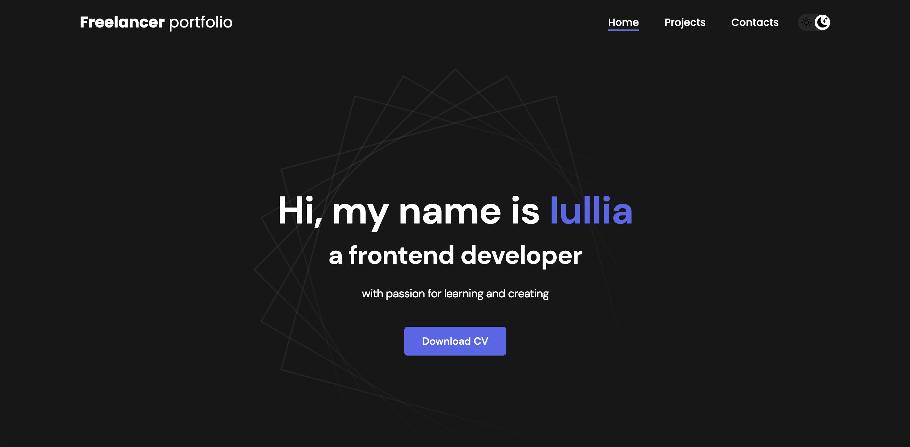
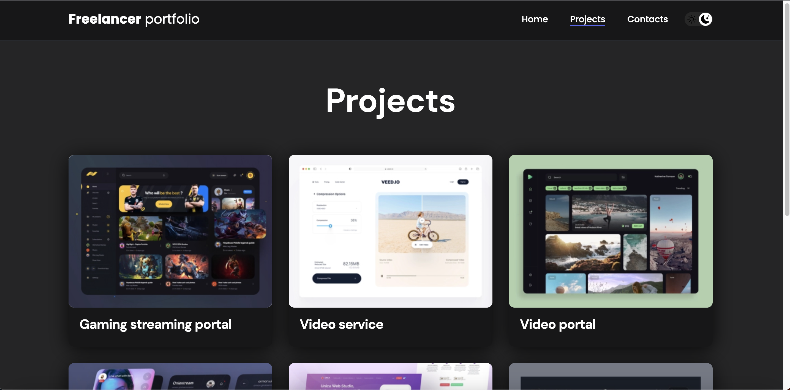
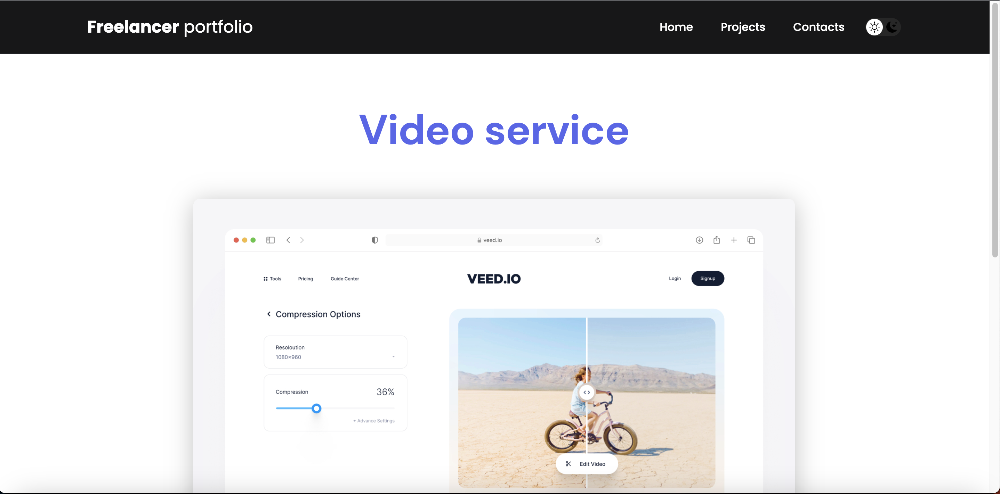

# Freelance Portfolio (React)

Добро пожаловать в репозиторий проекта портфолио фрилансера, созданного на React! Этот проект представляет собой шаблон веб-сайта портфолио для фрилансеров, разработанный с использованием React и его экосистемы.

## Особенности

- Адаптивный дизайн
- Компоненты на основе React
- React Router для навигации
- Легко кастомизировать

## Главная страница

## Портфолио

## Проект

## Контакты

## Темная тема

## Демонстрационная версия сайта
Посмотреть работу сайта в действии можно, перейдя по следующей ссылке: https://iuliiausatova.github.io/freelance-portfolio-react/